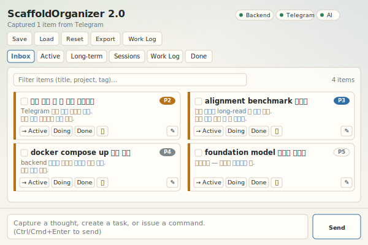
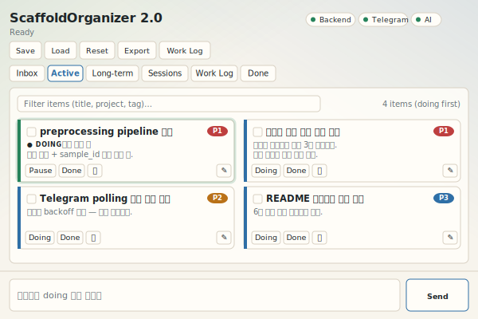
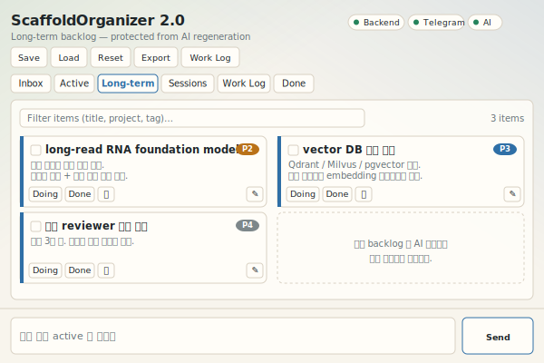
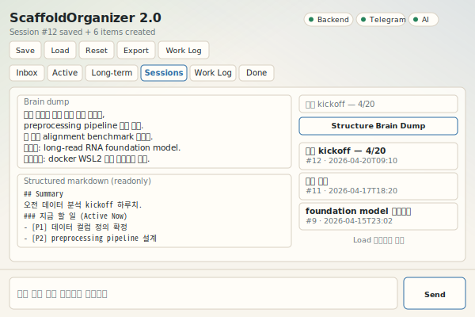
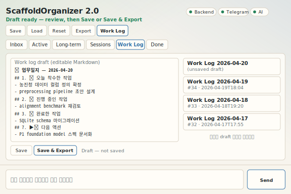
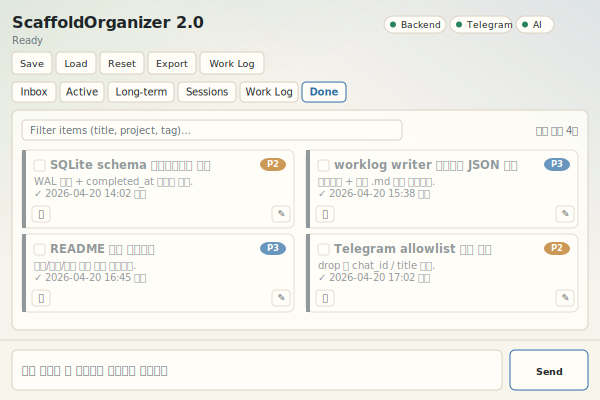

# ScaffoldOrganizer 2.0

An integrated task / worklog operating app. Combines a Telegram capture flow
with a local brain-dump + AI structuring flow, running as a **pywebview desktop
app under WSLg** with a FastAPI backend (WSL-native or Docker).

SQLite is the single source of truth. OpenAI (Responses API, with server-side
Prompt IDs) handles classification, routing, task structuring, and worklog
drafting. If no API key is configured the app falls back to deterministic
local logic so it stays usable offline.

---

## Screens

| Inbox | Active (todo + doing) | Long-term |
|:---:|:---:|:---:|
| [](docs/screens/01-inbox.svg) | [](docs/screens/02-active.svg) | [](docs/screens/03-longterm.svg) |

| Sessions | Work Log | Done |
|:---:|:---:|:---:|
| [](docs/screens/04-sessions.svg) | [](docs/screens/05-worklog.svg) | [](docs/screens/06-done.svg) |

See [docs/screens/](docs/screens/) for the individual SVGs and the visual
conventions (status border colours, priority chips, doing-card glow).

## Capabilities

- Telegram bot capture with `telegram_allowed_chat_ids` allowlist enforced
  before any API call or DB write
- Chat-like command input inside the GUI (`/chat/command` → LLM router →
  deterministic backend actions)
- Brain dump sessions structured into Markdown by `task_structurer`
- Item states: `inbox`, `todo`, `doing`, `done`, `archived`
- Horizons: `now`, `soon`, `later`, `long_term`
- Long-term backlog preserved across AI responses (AI never regenerates the
  full list)
- Session save / load / export (Markdown)
- Work log draft generation from the day's events + state transitions
- Graceful GUI ↔ backend lifecycle (GUI close → `/shutdown` → backend stop)

---

## Architecture

```
┌─ WSL (host) ─────────────────────────────┐
│                                          │
│   .venv  (pywebview + requests + backend)│
│     │                                    │
│     ▼  python scripts/run_gui.py         │
│   gui/launcher.py                        │
│     │                                    │
│     ├── subprocess ──▶ backend           │
│     │     (SCAFFOLD_BACKEND_MODE):       │
│     │       wsl    → python -m uvicorn   │
│     │       docker → docker compose up   │
│     │       external → skip, assume up   │
│     │                                    │
│     └── pywebview window ─▶ file://index │
│                      │                   │
│                      └─ HTTP 127.0.0.1:8765 ─▶ backend
└──────────────────────────────────────────┘
```

Key modules:

| Path                                           | Role                                                              |
| ---------------------------------------------- | ----------------------------------------------------------------- |
| [backend/main.py](backend/main.py)             | FastAPI app, lifecycle, endpoints                                 |
| [backend/services/ai_service.py](backend/services/ai_service.py)         | OpenAI Responses API boundary, per-role model / prompt_id / format |
| [backend/services/router_service.py](backend/services/router_service.py) | chat command routing; DB writes outside LLM call                  |
| [backend/services/telegram_service.py](backend/services/telegram_service.py) | polling, allowlist enforcement, exponential backoff               |
| [backend/services/item_service.py](backend/services/item_service.py)     | item CRUD + state transitions                                     |
| [backend/services/session_service.py](backend/services/session_service.py)| brain-dump session save / load / export                          |
| [backend/services/worklog_service.py](backend/services/worklog_service.py)| daily context assembly + worklog draft                           |
| [backend/db/schema.sql](backend/db/schema.sql) | SQLite schema with WAL mode                                       |
| [gui/launcher.py](gui/launcher.py)             | starts backend, opens pywebview, shuts backend down               |
| [gui/index.html](gui/index.html) + [assets/app.js](gui/assets/app.js) + [assets/style.css](gui/assets/style.css) | 600×400 UI, Noto Sans font base, sticky command bar |
| [scripts/release.sh](scripts/release.sh)       | rsync `developing/` → `building/`, set up venv + docker + Start-menu entry |

---

## Prerequisites

### Windows (host)

- Windows 10 22H2+ or Windows 11 (for WSLg / `$DISPLAY=:0`)
- Docker Desktop (optional — only for `SCAFFOLD_BACKEND_MODE=docker`)

### WSL (Ubuntu 22.04 / 24.04)

System packages for the pywebview GTK backend and Korean rendering:

```bash
sudo apt update
sudo apt install -y \
  python3-venv python3-gi python3-gi-cairo \
  gir1.2-webkit2-4.1 \
  fonts-noto-cjk fonts-noto-cjk-extra \
  ibus ibus-hangul      # only if typing Korean directly in WSL
sudo fc-cache -fv
```

Enable ibus-hangul (once, for Korean IME inside WSL):

```bash
cat >> ~/.bashrc <<'EOF'
export GTK_IM_MODULE=ibus
export XMODIFIERS=@im=ibus
export QT_IM_MODULE=ibus
EOF
source ~/.bashrc
ibus-daemon -drx
ibus-setup    # Input Method → Add → Korean → Hangul
```

---

## Configuration

Copy the example template and fill real values:

```bash
cp config/config_example.json config/config.json
```

`config/config.json` is **gitignored**. Only `config_example.json` and
`config.schema.json` are committed.

Required fields:

```jsonc
{
  "app_name": "ScaffoldOrganizer 2.0",
  "backend_host": "127.0.0.1",
  "backend_port": 8765,

  "db_path": "data/scaffold_workbench.sqlite3",

  "telegram_enabled": false,
  "telegram_bot_token": "",               // or $TELEGRAM_BOT_TOKEN env
  "telegram_allowed_chat_ids": [],        // empty = accept all, logs warning
  "telegram_poll_interval_seconds": 1.0,

  "openai_api_key": "",                   // or $OPENAI_API_KEY env

  "ai_roles": {
    "command_router":  { "prompt_id": "pmpt_...", "model": "gpt-4.1-mini",
                         "prompt_file": "backend/prompts/command_router.md",
                         "response_format": "json",     "max_output_tokens": 512,  "temperature": 0.2 },
    "classifier":      { "prompt_id": "pmpt_...", "model": "gpt-4.1-mini",
                         "prompt_file": "backend/prompts/classifier.md",
                         "response_format": "json",     "max_output_tokens": 512,  "temperature": 0.2 },
    "task_structurer": { "prompt_id": "pmpt_...", "model": "gpt-4.1",
                         "prompt_file": "backend/prompts/task_structurer.md",
                         "response_format": "markdown", "max_output_tokens": 2048, "temperature": 0.3 },
    "worklog_writer":  { "prompt_id": "pmpt_...", "model": "gpt-4.1",
                         "prompt_file": "backend/prompts/worklog_writer.md",
                         "response_format": "markdown", "max_output_tokens": 2048, "temperature": 0.3 }
  },

  "wsl_backend_entrypoint": "/home/<user>/.../developing",
  "wsl_distribution_name": "Ubuntu",

  "ui_refresh_interval_ms": 2000,
  "pywebview": { "width": 600, "height": 400 }
}
```

### AI roles

Each role's developer message is registered on the OpenAI dashboard and
referenced by `prompt_id`. The dashboard default version is always used —
no pinning — so prompt edits roll out immediately.

When a role has **no `prompt_id`** the local `.md` under `backend/prompts/`
is sent as a `developer` message instead. This keeps the app working in
development and offline.

`response_format` drives how the raw response is handled:

- `"json"` — parsed via `json.loads` into a dict. Used by `classifier`, `command_router`.
- `"markdown"` — wrapped into `{"content_md": ...}` untouched. Used by `task_structurer`, `worklog_writer`.

### Secrets

`openai_api_key` and `telegram_bot_token` can be set via env vars
(`OPENAI_API_KEY`, `TELEGRAM_BOT_TOKEN`) to avoid writing them into
`config.json`.

### Telegram allowlist

`telegram_allowed_chat_ids` is an allowlist. Any update with a chat_id
**not on the list** is dropped at the top of `_handle_update`, before any
AI call or DB write, and a warning with the `chat_id` is logged so you can
discover legitimate senders and populate the list. An empty list accepts
all chats and logs a startup WARNING.

---

## Running — development

```bash
python3 -m venv --system-site-packages .venv     # gi from system
source .venv/bin/activate
pip install -r requirements-gui.txt
pip install -r requirements-backend.txt

# default: wsl mode — launcher runs python -m uvicorn locally
python scripts/run_gui.py

# or docker mode — launcher runs `docker compose up --build backend`
SCAFFOLD_BACKEND_MODE=docker python scripts/run_gui.py

# or external mode — bring your own backend (already running on :8765)
SCAFFOLD_BACKEND_MODE=external python scripts/run_gui.py
```

Env var overrides:

| Variable                           | Meaning                                                |
| ---------------------------------- | ------------------------------------------------------ |
| `SCAFFOLD_BACKEND_MODE`            | `wsl` (default) \| `docker` \| `external`              |
| `SCAFFOLD_BACKEND_URL`             | where the launcher polls `/health` (default derived)   |
| `SCAFFOLD_BACKEND_READY_TIMEOUT`   | seconds to wait for `/health` (default `45`)           |
| `SCAFFOLD_WSL_ENTRYPOINT`          | override `wsl_backend_entrypoint` from config          |
| `SCAFFOLD_WSL_DIST`                | override `wsl_distribution_name` from config           |
| `OPENAI_API_KEY`, `TELEGRAM_BOT_TOKEN` | secrets, injected into backend env                 |

Backend only (no GUI):

```bash
bash scripts/run_backend.sh                 # local uvicorn
bash scripts/run_backend_docker.sh          # docker compose up backend
```

---

## Running — release (WSL, Start-menu integrated)

`scripts/release.sh` prepares a sibling `building/` directory that's
launch-ready and adds a WSLg `.desktop` entry so Windows Start menu shows
the app.

```bash
cd developing
./scripts/release.sh                 # rsync + venv + docker image + .desktop
./scripts/release.sh --rsync-only    # just sync, nothing else
./scripts/release.sh --mode docker   # bake SCAFFOLD_BACKEND_MODE=docker into run.sh
./scripts/release.sh --no-docker     # skip image build
```

Outputs:

```
../building/
├── .venv/                             # Python env (pywebview + backend deps)
├── run.sh                             # executable launcher
├── config/config.json                 # seeded from source if possible
└── backend/ gui/ scripts/ ...         # rsynced sources
```

Launch:

```bash
~/personal/260420_scaffold_assistant_2/building/run.sh
# or: Windows Start menu → search "ScaffoldOrganizer 2.0"
```

`run.sh` activates `.venv`, exports the release-time
`SCAFFOLD_BACKEND_MODE`, and execs `python scripts/run_gui.py`. Close the
window → backend shuts down automatically.

Re-running `release.sh` is safe and idempotent: `.venv`, `data/`, `logs/`,
`exports/` are preserved by the rsync exclude list.

---

## Using the app

### Tabs

- **Inbox** — uncommitted captures (Telegram raw input, low-confidence classifications)
- **Active** — `status=todo`, non-long-term
- **Doing** — `status=doing`, highlighted with green border + shadow
- **Long-term** — `horizon=long_term` (protected from AI regeneration)
- **Sessions** — brain-dump sessions; click Load to restore raw + structured text
- **Work Log** — generated worklog drafts
- **Done** — completed items

### Command bar (bottom, sticky)

Type natural-language commands. Examples:

- `이건 장기 과제로 보내` → move selected item to long_term
- `오늘 한 일 기준으로 업무일지 초안 만들어줘` → triggers `generate_worklog`
- `선택된 항목을 doing으로 바꿔` → mark selected items doing
- `이 내용은 thought로 저장` → create item with `item_type=thought`

`Ctrl/Cmd+Enter` submits. Select items (checkboxes on cards) before
referring to "선택된 / this" in a command.

### Toolbar buttons

| Button | Effect                                                            |
| ------ | ----------------------------------------------------------------- |
| New    | clears editor + session title (doesn't touch DB)                  |
| Save   | `POST /sessions/save` with current raw + structured text          |
| Clear  | clears editor only                                                |
| Export | `POST /export/markdown` — dumps all items by status               |
| Work Log | `POST /worklog/generate` — LLM drafts today's worklog in Markdown |

### Keyboard / filtering

- `Ctrl/Cmd+Enter` — send command
- Filter input (180ms debounce) — matches title, project, content, tags
- Tab bar — click any tab, always re-fetches immediately

---

## API

| Method | Path                         | Notes                                                 |
| ------ | ---------------------------- | ----------------------------------------------------- |
| GET    | `/health`                    | liveness probe for launcher                           |
| GET    | `/status`                    | backend / telegram / ai dots for the top-right strip  |
| GET    | `/config/ui`                 | non-secret values GUI needs at boot (refresh interval etc.) |
| POST   | `/shutdown`                  | graceful drain, kills uvicorn                         |
| GET    | `/items`                     | filter by `status`, `horizon`, `item_type`            |
| POST   | `/items`                     | manual item create                                    |
| PATCH  | `/items/{id}`                | partial update                                        |
| POST   | `/items/{id}/status`         | status transition, records event                      |
| POST   | `/items/{id}/archive`        | shortcut to `status=archived`                         |
| POST   | `/chat/command`              | NL command → router → deterministic actions           |
| POST   | `/chat/capture`              | one-shot classify + create (no router)                |
| POST   | `/brain-dump/structure`      | save session with LLM-generated markdown              |
| GET    | `/sessions`                  | list                                                  |
| GET    | `/sessions/{id}`             | with linked items                                     |
| POST   | `/sessions/save`             | create a new session row                              |
| POST   | `/sessions/{id}/export`      | write session markdown to disk                        |
| POST   | `/export/markdown`           | all items by status                                   |
| POST   | `/worklog/generate`          | assemble + LLM draft + optionally save                |
| GET    | `/worklogs`                  | list                                                  |
| POST   | `/worklogs/{id}/export`      | write worklog markdown to disk                        |

---

## Distribution notes

Never commit:

- `config/config.json`
- `.env`, `.env.*` (except `.env.example`)
- `data/`, `logs/`, `exports/`
- `*.db`, `*.sqlite`, `*.sqlite3`
- `dist/`, `build/`, `*.spec`, `__pycache__/`, `.pytest_cache/`, `.venv/`
- `cli-history*`, `local_debug/`, `.docker/`, `.docker-cache/`

All of these are in [`.gitignore`](.gitignore). `config_example.json` is the
committed template; real values go in `config.json` locally.

---

## Troubleshooting

**`RuntimeError: Backend did not become healthy within 45 seconds`** — run
the exact command that the launcher issues to see what's failing:

```bash
# wsl mode
python3 -m uvicorn backend.main:app --host 127.0.0.1 --port 8765

# docker mode
docker compose up --build backend
```

Common causes: missing backend deps (`pip install -r requirements-backend.txt`),
port 8765 already bound, or docker not running.

**Window doesn't appear on `python scripts/run_gui.py`** — check `echo $DISPLAY`
returns `:0`. If empty, WSLg isn't active. See "Prerequisites" above.

**Korean text renders as 딩벳 boxes** — install CJK fonts:
`sudo apt install -y fonts-noto-cjk && fc-cache -fv`. Restart the app.

**Korean IME doesn't work in textarea** — ibus-hangul is not running or not
configured for GTK. See "Prerequisites" above. Paste (Ctrl+V) always works.

**AI dot shows `Local fallback`** — `openai_api_key` is empty or invalid.
Check `config.json` or `$OPENAI_API_KEY`. The app still works, returning
deterministic fallback responses.

**Telegram polling silently drops messages** — this is by design when the
sender's chat_id isn't on `telegram_allowed_chat_ids`. Check the backend log
for lines like `telegram: dropped message from unauthorized chat_id=… — add
to telegram_allowed_chat_ids to accept`.

---

## Tests

```bash
docker run --rm -v "$PWD":/app -w /app developing-backend:latest \
  sh -c "pip install -q pytest && python -m pytest tests/ -v"
```

Covers: config validation, DB bootstrap + state transitions, router
fallback, worklog context assembly, AIService path selection (prompt_id vs
local developer message), and the `digest_items` token-trim helper.
